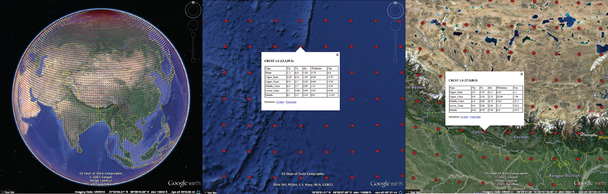

# Crust 1.0 and Google Earth

This project is a python adaptation of the [Crust
1.0](http://igppweb.ucsd.edu/~gabi/crust1.html) model that also makes a kmz file
to allow browsing the model and exploration of variations in crustal structure.
[Crust 1.0](http://igppweb.ucsd.edu/~gabi/crust1.html) is a one-degree model of
the crust that includes (as needed) layers characterizing water or ice cover,
sedimentary layering, upper, middle, and lower crust, and the uppermost mantle
wave speed.

The Crust 1.0 model is a product of Gabi Laske, Zhitu Ma, Guy Masters
([UCSD](http://ucsd.edu)) and Michael Pasyanos([LLNL](https://www.llnl.gov)).
More information about the model and the original FORTRAN routines can be found
on the [Crust 1.0 webpage](http://igppweb.ucsd.edu/~gabi/crust1.html).

[Google Earth](https://www.google.com/earth/) is a free, multi-platform,
widely-used interactive GIS mapping tool. The file format, kml (keyhole markup
language) is reasonably well documented a flexible enough to allow easy import
of point, polygon, and raster data into the tool. Data for many earth-science
analyses are readily available in KML format, including mnay resources from the
[USGS KML page](http://earthquake.usgs.gov/learn/kml.php), the [KML Geology
page](http://www.geology.sdsu.edu/kmlgeology), [weather data from the National
Weather Service](http://www.srh.noaa.gov/gis/kml/), and [streamflow data](stream
flow data kml). The popularity and ease of use of the [Google
Earth](https://www.google.com/earth/) makes it ideal for educational
applications because students are familiar with the tool or certainly familiar
with the style of interaction needed to use the tool. It also provides quick
access to the model for researchers that wish to quickly and visually locate
crustal information.

Rather than encode the model with a visualization (such as [Visual
Crust](http://www.visualearth.org/globalcrust10/crust10web/visualcrust10.html )),
we constructed a file that loads simple interactive markers that when clicked,
present a listing of the Crust 1.0 layered model for the one-degree cell
centered on the marker. The listing can be easily copied into other quantitative
tools or spreadsheets for more detailed analysis, or simply read. A sample model
listing is shown below. The heading and layer labels are constructed to allow
easy importing of the information into scientific analysis tools or spreadsheet
tools like Excel. For example, they can be loaded into Mathematica using the
ImportString command or pasted directly into Excel.
<pre>
Type	Vp	Vs	rho	Thickness	Top
Upper_Seds.	2.5	1.07	2.11	0.5	0.51
Middle_Seds.	4.6	2.59	2.46	4.0	0.01
Lower_Seds.	5.0	2.88	2.54	1.5	-3.99
Upper_Crust	6.3	3.63	2.79	14.41	-5.49
Middle_Crust	6.6	3.8	2.86	12.68	-19.9
Lower_Crust	7.0	3.99	2.95	7.21	-32.58
Mantle	8.25	4.57	3.39	0.0	-39.79
</pre>

In this repository there is a pythonic way to access the model as well as a tool
to produce a KMZ file to allow exploration of the model through the intuitive
interface of [Google Earth](https://www.google.com/earth/). The final KMZ is
also included so you don't have to use the Python scripts unless you want to
modify anything or access it from your own program.

## How do I use it?
If you just want to use the [Google Earth](https://www.google.com/earth/) file,
simply download the repository by clicking the "Download Zip" button above.
Unzip the file and find the KMZ file. Open it in [Google
Earth](https://www.google.com/earth/) and explore by clicking on a red point.
The pop-up box will show you the latitude and longitude of that point and the
information for each layer of the model. Information includes the
[P-wave](https://en.wikipedia.org/wiki/P-wave) speed [km/s],
[S-wave](https://en.wikipedia.org/wiki/S-wave) speed [km/s],
[density](https://en.wikipedia.org/wiki/Density) [g/cc], layer thickness [km],
and elevation of the top of the layer with respect to sea level [km]. If you're
not familiar with the structure of the Earth, explore it with some
activities (below) and read about the [structure of the
Earth](https://en.wikipedia.org/wiki/Structure_of_the_Earth). You can copy and
paste information out of the pop-up box as plain-text. Try exploring the
different types of crust (continental and oceanic), noting differences between
them.

## Where are things?
* The final KMZ file for [Google Earth](https://www.google.com/earth/) is in the main directory.
* Activities are listed below.
* Images and other things used for the documentation are in [docs](docs/).
* The Python files and model data in all in [model](model/).

## Activities
* **Transitional Crust - from Continent to Ocean:**
	Look at the crustal structure along the continental margin of the coast of the
	[United States](https://en.wikipedia.org/wiki/United_States) east of Florida.
	Explore the crustal structure beneath regions of flooded continental material
	such as the [Persian Gulf](https://en.wikipedia.org/wiki/Persian_Gulf),
	southeast [Asia](https://en.wikipedia.org/wiki/Asia), north of Russia near
	[Novaya Zemlya](https://en.wikipedia.org/wiki/Novaya_Zemlya). What differences
  can you find? How does the crust change from continental to oceanic crust?

* **Large Plateaus and Deep Valleys:**
	Describe the crustal structure beneath the [Tibetan
	Plateau](https://en.wikipedia.org/wiki/Tibetan_Plateau). Then examine the
	crust beneath the [Altiplano of
	Bolivia](https://en.wikipedia.org/wiki/Altiplano). Contrast that structure
	with that centered on [Death
	Valley](https://en.wikipedia.org/wiki/Death_Valley) in the central [Basin and
	Range](https://en.wikipedia.org/wiki/Basin_and_Range_Province), the [Dead
	Sea](https://en.wikipedia.org/wiki/Dead_Sea) Rift in the Middle East, and the
	[Salton Trough](https://en.wikipedia.org/wiki/Salton_Trough) of Southern
	California.

* **Mountain Ranges:**
	Explore patterns in crustal thickness beneath active mountain regions such as
	the [Himalayas](https://en.wikipedia.org/wiki/Himalayas), the
	[Alps](https://en.wikipedia.org/wiki/Alps), the
	[Zagros](https://en.wikipedia.org/wiki/Zagros_Mountains), the [Tien
	Shan](https://en.wikipedia.org/wiki/Tian_Shan), and the [Rocky
	Mountains](https://en.wikipedia.org/wiki/Rocky_Mountains).

* **Platforms and Shields:**
	Compare the crustal structure beneath the [shield regions of
	Canada](https://en.wikipedia.org/wiki/Canadian_Shield) and the
	sediment-covered regions of the northern [Great Plains of the United
	States](https://en.wikipedia.org/wiki/Great_Plains). Then compare the crust
	beneath the [Arabian
	shield](https://en.wikipedia.org/wiki/Arabian-Nubian_Shield) and platform
	across [Saudi Arabia](https://en.wikipedia.org/wiki/Saudi_Arabia). What is the
	primary difference between the crust in these regions?

* **Rifts:**
	Compare the crust beneath actively extending continental regions such as the
	western conterminous United States, the [east African
	Rift](https://en.wikipedia.org/wiki/East_African_Rift), the [Lake
	Baikal](https://en.wikipedia.org/wiki/Lake_Baikal) region. How does it
  compare to stable regions?

## Contributing
We always welcome new ideas and improvements. Feel free to fork the repository
and make modifications, file issues, etc. You can always email the authors for
more information. Improvements in rendering and development of curriculum with
educators are potential areas for future development.

## References
* [Laske, Gabi, et al. "Update on CRUST1. 0-A 1-degree global model of Earth’s crust." *Geophys. Res. Abstracts*. Vol. 15. 2013.](http://meetingorganizer.copernicus.org/EGU2013/EGU2013-2658.pdf)

## Contact

John Leeman : jleeman@psu.edu
 Charles Ammon : charlesammon@psu.edu
